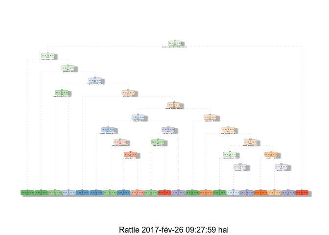

# Prediction Assignment Writeup
Hal12345  
25/2/2017  


## Synopsys
Using devices such as Jawbone Up, Nike FuelBand, and Fitbit it is now possible to collect a large amount of data about personal activity relatively inexpensively. These type of devices are part of the quantified self movement – a group of enthusiasts who take measurements about themselves regularly to improve their health, to find patterns in their behavior, or because they are tech geeks. They were asked to perform barbell lifts correctly and incorrectly in 5 different ways. More information is available from the website here: http://groupware.les.inf.puc-rio.br/har (see the section on the Weight Lifting Exercise Dataset).

## Citations
Ugulino, W.; Cardador, D.; Vega, K.; Velloso, E.; Milidiu, R.; Fuks, H. Wearable Computing: Accelerometers' Data Classification of Body Postures and Movements. Proceedings of 21st Brazilian Symposium on Artificial Intelligence. Advances in Artificial Intelligence - SBIA 2012. In: Lecture Notes in Computer Science. , pp. 52-61. Curitiba, PR: Springer Berlin / Heidelberg, 2012. ISBN 978-3-642-34458-9. DOI: 10.1007/978-3-642-34459-6_6.

Read more: http://groupware.les.inf.puc-rio.br/har#ixzz4ZiXJY7dM

## The setting

```r
library(ggplot2)
library(lattice)
library(caret)
library(rpart)
library(rattle)
```

```
## R session is headless; GTK+ not initialized.
```

```
## Rattle : une interface graphique gratuite pour l'exploration de données avec R.
## Version 4.1.0 Copyright (c) 2006-2015 Togaware Pty Ltd.
## Entrez 'rattle()' pour secouer, faire vibrer, et faire défiler vos données.
```

```r
library(randomForest)
```

```
## randomForest 4.6-12
```

```
## Type rfNews() to see new features/changes/bug fixes.
```

```
## 
## Attaching package: 'randomForest'
```

```
## The following object is masked from 'package:ggplot2':
## 
##     margin
```

## The question
One thing that people regularly do is quantify how much of a particular activity they do, but they rarely quantify how well they do it. In this project, your goal will be to use data from accelerometers on the belt, forearm, arm, and dumbell of 6 participants. 


## The data

The training data for this project are available here: https://d396qusza40orc.cloudfront.net/predmachlearn/pml-training.csv

The test data are available here: https://d396qusza40orc.cloudfront.net/predmachlearn/pml-testing.csv

The dataset are supposed to have been dowloaded inside the working directory

A quick look at the dataset shows that there are a lot of values that are missing (NULL, NA, #DIV/0!). They will all be considered as NA values


```r
trads <- read.csv('pml-training.csv', na.strings=c('', '#DIV/0!', 'NA'), header=TRUE, sep=',')
tstds <- read.csv('pml-testing.csv', na.strings=c('', '#DIV/0!', 'NA'), header=TRUE, sep=',')
dim(trads)
```

```
## [1] 19622   160
```

```r
dim(tstds)
```

```
## [1]  20 160
```

### Cleansing

```r
#clensing

#get rid of all NA colums
trads<-Filter(function(trads)!all(is.na(trads)), trads)
tstds<-Filter(function(tstds)!all(is.na(tstds)), tstds)

#get rid of usless predictors
trads$X<-NULL
trads$user_name	<- NULL
trads$raw_timestamp_part_1 <- NULL	
trads$raw_timestamp_part_2 <- NULL	
trads$cvtd_timestamp <- NULL	
trads$new_window <- NULL
trads$num_window <- NULL

#keep only common complet columns in both training and testing datasets
commoncols<-intersect(colnames(trads),colnames((tstds)))
classe<-trads$classe
problem_id<-tstds$problem_id
trads<-trads[,commoncols]
tstds<-tstds[,commoncols]

trads$classe<-classe
tstds$problem_id<-problem_id

#keep only complete cases for the training set
trads<-trads[complete.cases(trads), ] 
dim(trads)
```

```
## [1] 19622    53
```

##Prediction

###Partitioning the data in training and testing sets


```r
intrads<-createDataPartition(y=trads$classe, p=0.60,list=FALSE)
traintrads <- trads[intrads,]
testtrads <- trads[-intrads,]
set.seed(999)
```

###Predicting model with Trees


```r
model1 <- rpart(classe ~ ., data=traintrads, method="class")
fancyRpartPlot(model1)
```

<!-- -->

```r
predict1 <- predict(model1, testtrads, type = "class")  
confusionMatrix(predict1, testtrads$classe) 
```

```
## Confusion Matrix and Statistics
## 
##           Reference
## Prediction    A    B    C    D    E
##          A 2040  325  107  210   75
##          B   68  901  116   66  115
##          C   48  116 1020  203  172
##          D   38  110   81  687   64
##          E   38   66   44  120 1016
## 
## Overall Statistics
##                                           
##                Accuracy : 0.7219          
##                  95% CI : (0.7118, 0.7318)
##     No Information Rate : 0.2845          
##     P-Value [Acc > NIR] : < 2.2e-16       
##                                           
##                   Kappa : 0.6451          
##  Mcnemar's Test P-Value : < 2.2e-16       
## 
## Statistics by Class:
## 
##                      Class: A Class: B Class: C Class: D Class: E
## Sensitivity            0.9140   0.5935   0.7456  0.53421   0.7046
## Specificity            0.8723   0.9423   0.9168  0.95534   0.9582
## Pos Pred Value         0.7399   0.7117   0.6543  0.70102   0.7913
## Neg Pred Value         0.9623   0.9062   0.9446  0.91276   0.9351
## Prevalence             0.2845   0.1935   0.1744  0.16391   0.1838
## Detection Rate         0.2600   0.1148   0.1300  0.08756   0.1295
## Detection Prevalence   0.3514   0.1614   0.1987  0.12490   0.1637
## Balanced Accuracy      0.8931   0.7679   0.8312  0.74477   0.8314
```
We notice that the accuracy is pretty poor 0.7075

###Predicting model with Bagging

```r
predictors <- traintrads
predictors$classe <- NULL

model2 <- bag(predictors, traintrads$classe, B = 10,
                bagControl = bagControl(fit = ctreeBag$fit,
                                        predict = ctreeBag$pred,
                                        aggregate = ctreeBag$aggregate))
```

```
## Warning: executing %dopar% sequentially: no parallel backend registered
```

```r
predict2 <- predict(model2, testtrads, type = "class")  
confusionMatrix(predict2, testtrads$classe) 
```

```
## Confusion Matrix and Statistics
## 
##           Reference
## Prediction    A    B    C    D    E
##          A 2193   65   10   11    1
##          B   16 1383   61   14    9
##          C    7   47 1278   59   11
##          D   12    8   12 1187   28
##          E    4   15    7   15 1393
## 
## Overall Statistics
##                                           
##                Accuracy : 0.9475          
##                  95% CI : (0.9423, 0.9523)
##     No Information Rate : 0.2845          
##     P-Value [Acc > NIR] : < 2.2e-16       
##                                           
##                   Kappa : 0.9335          
##  Mcnemar's Test P-Value : 1.219e-11       
## 
## Statistics by Class:
## 
##                      Class: A Class: B Class: C Class: D Class: E
## Sensitivity            0.9825   0.9111   0.9342   0.9230   0.9660
## Specificity            0.9845   0.9842   0.9809   0.9909   0.9936
## Pos Pred Value         0.9618   0.9326   0.9116   0.9519   0.9714
## Neg Pred Value         0.9930   0.9788   0.9860   0.9850   0.9924
## Prevalence             0.2845   0.1935   0.1744   0.1639   0.1838
## Detection Rate         0.2795   0.1763   0.1629   0.1513   0.1775
## Detection Prevalence   0.2906   0.1890   0.1787   0.1589   0.1828
## Balanced Accuracy      0.9835   0.9476   0.9575   0.9569   0.9798
```

The accuracy 0.9565 is much better that the one computed by Tree

###Predicting model with Random forest


```r
model3<-randomForest(formula = classe ~ ., data = traintrads, nPerm=5) 
predict3 <- predict(model3, testtrads, type = "class")  
confusionMatrix(predict3, testtrads$classe) 
```

```
## Confusion Matrix and Statistics
## 
##           Reference
## Prediction    A    B    C    D    E
##          A 2232    4    0    0    0
##          B    0 1510   21    0    0
##          C    0    4 1345   13    0
##          D    0    0    2 1273    6
##          E    0    0    0    0 1436
## 
## Overall Statistics
##                                           
##                Accuracy : 0.9936          
##                  95% CI : (0.9916, 0.9953)
##     No Information Rate : 0.2845          
##     P-Value [Acc > NIR] : < 2.2e-16       
##                                           
##                   Kappa : 0.9919          
##  Mcnemar's Test P-Value : NA              
## 
## Statistics by Class:
## 
##                      Class: A Class: B Class: C Class: D Class: E
## Sensitivity            1.0000   0.9947   0.9832   0.9899   0.9958
## Specificity            0.9993   0.9967   0.9974   0.9988   1.0000
## Pos Pred Value         0.9982   0.9863   0.9875   0.9938   1.0000
## Neg Pred Value         1.0000   0.9987   0.9965   0.9980   0.9991
## Prevalence             0.2845   0.1935   0.1744   0.1639   0.1838
## Detection Rate         0.2845   0.1925   0.1714   0.1622   0.1830
## Detection Prevalence   0.2850   0.1951   0.1736   0.1633   0.1830
## Balanced Accuracy      0.9996   0.9957   0.9903   0.9943   0.9979
```

With an accuracy of 0.994, Random forest is the winner

###Prediction model with the given test dataset using Random forest

```r
modelprediction<-predict(model3, newdata=tstds)
```

###Predicted classes with the selected model

```r
modelprediction
```

```
##  1  2  3  4  5  6  7  8  9 10 11 12 13 14 15 16 17 18 19 20 
##  B  A  B  A  A  E  D  B  A  A  B  C  B  A  E  E  A  B  B  B 
## Levels: A B C D E
```


